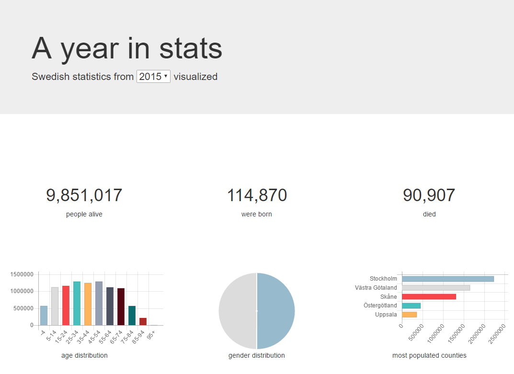

# A year in stats

## Assignment
Create a "A Year in stats" web application that grabs statistics data from some external service and visualize them in an interesting way. You can choose to either:

**A)** Continue building the starter project contained in this directory

**B)** Build an application from scratch.

If you choose **A)** to work on the starter project, here are some suggestions for things to do:

* UI/UX - Can you make improvements to the look and feel of the application? Who is the target user, and what would it wish to change?
* Functionality - Add more statistics and/or ways to interact with it.
* Test - Currently there are no tests for the starter project. If you, a team member or a third party changed something, how would you make sure everything still works as intended?
* Refactor - Does the architecture of the application make sense? How about names of classes/components/functions/variables? File structure? Is there repetition that can be cleaned up?

The screenshot below should give you some idea of what it could look like:



### Requirements
* Your application should contain some sort of user-interaction. For example, the user could navigate to different pages for displaying different stats, or customize the way that data is displayed (think: tables, graphs, maps, bars, lines and pies).

* It should be structured as a single-page application, without any server-side rendering or templating. Although using a server for static assets, API proxies, browser reloading etc. is fine.

* Using external libraries and/or frameworks is encouraged, as long as you can motivate your choices and show that you understand the consequences of including them. The same goes for CSS preprocessors, JavaScript transpilers and other build system dependencies.

* Your application should NOT make use of browser plugins such as Flash, Java or similar runtime environments.

### Tips/Notes
* SCB (Statistiska Centralbyrån) has a [publically available API](http://www.scb.se/api/) you can use to fetch statistics from.
* [Chart.js](https://github.com/chartjs/Chart.js) makes it relatively simple to visualize data, unless you want to roll your own solution (also see [angular-chart.js](https://github.com/jtblin/angular-chart.js) if you're working with AngularJS).
* Include tasks for building/serving/testing your code as npm scripts (`scripts` property in `package.json`). This way you can use package-specific dependencies instead of installing them globally on a machine.
* The Starter Project has been prepared with some configuration for Visual Studio Code, but you can use any text editor that you are comfortable with.
* This task could be done in an hour, a day or a year. Choose how much time you want to spend on it and what aspects you want to prioritize. 

## Starter project
This directory contains a fully functional application that you can choose to extend. Feel free to make any changes you like, and document your changes (`git` is strongly encouraged).

### Quick start
All you need is NodeJS (tested with v8.1.3) and NPM (tested with v5.3.0).

1. Install dependencies (webpack, TypeScript etc.): `npm install`
2. Start up a development server: `npm start`. Go to `http://localhost:8080` in your browser.
3. Edit files in `src/` and watch your browser refresh automatically.

You can also run `npm run build`, which will output your application in the `web/` directory. This is not really needed, but it can be useful if you want to have a look at the code that is actually delivered to the browser.


### Directory contents
```
node_modules/              // dependencies
web/                       // bundled ("compiled") code
src/                       // source code (make changes in here)
  components/
    app/                   // Application root
    stat-chart/            // Example stat card
  services/
    scb.service.ts         // example service for communicating with SCB API
  types/                   // some custom type definitions
  app.ts                   // application entry point
  index.html               
package.json               // NPM configuration
README.md                  // this file
tsconfig.json              // TypeScript configuration
webpack.config.js          // webpack configuration
```


# Things to discuss
DESIGN
* Responsiveness
* UX
* Browser compatibility

API
* Data models and abstractions used when communicating with SCB
* Handling of anynchronous calls (Angular services, callbacks, promises, async/await)
* Error handling (404:s, rate limiting, connectivity loss, race conditions)

CODE
* Frameworks & dependencies - Why use X and how does it work? Why not Y?
* Language - TypeScript? EcmaScript? CoffeScript? JavaScript?
* Architecture - MVC? Components?
* Reusable code - How much copy-paste is there and why?
* Testable code - Are there tests? Unit tests? E2E tests? If not, how and why would you write them? Is the code easy to test?

TIME ALLOCATION
* How much time was spent on the assignment?
* Which part did you spend the most/least ammount of time on?
* Which was the fun part - Graphical design, tinkering with build tools, writing beautiful abstractions, exploring API:s etc?
* Which was the boring part - Fighting with CSS margins, debugging in dependency hell, untangling spaghetti code, falling asleep while reading API docs etc.?

PROBABLE PROBLEMS AND COMMON SOLUTIONS
* The API does not support CORS - Use a proxy
* The API has a rate limit - Backoff and/or display errors
* The API documentation is very limited - Play around with requests and observe responses
* The API is very low-level - Use proper abstractions, or get data from somewhere else.
* Responsive design can be tricky - Use Bootstrap or Flex or ...
* Browser compatibility is tricky - Use Babel or Sass or ...
* Working with stats can be done in many ways - Use CSS or tables or D3 or chart.js or ...